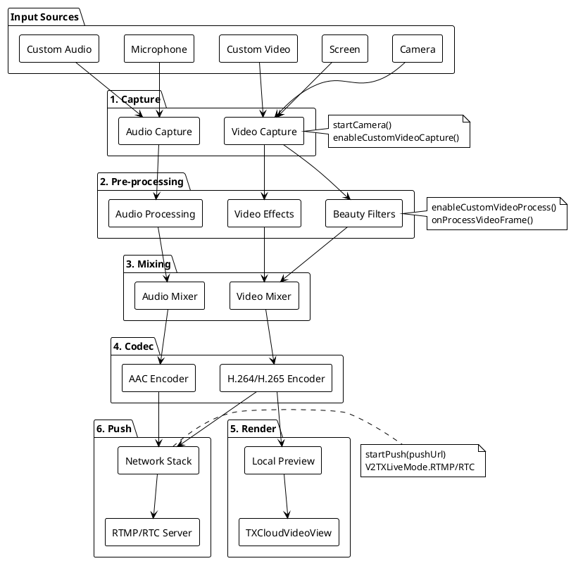
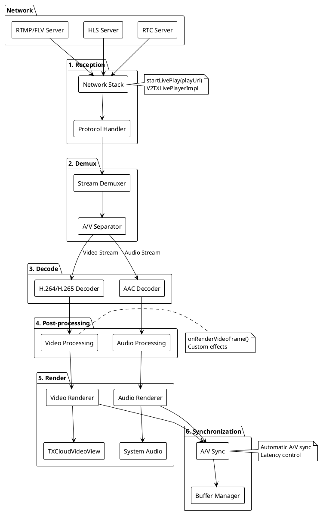
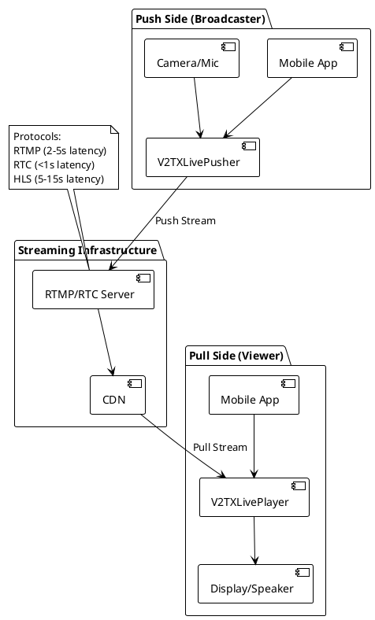

# MLVB Stream Processing Pipeline Documentation

This document describes the core pipeline architecture for pushing and pulling streams in the MLVB (Mobile Live Video Broadcasting) SDK.

## Push Stream Pipeline

The push stream pipeline consists of the following stages:

### 1. Capture
**Purpose**: Acquire video and audio data from input sources
- **Video Sources**: Camera (`startCamera()`), Screen recording, Custom video frames
- **Audio Sources**: Microphone (`startMicrophone()`), Custom audio data
- **Implementation**:
  - Camera capture via `V2TXLivePusher.startCamera(true/false)` for front/rear camera
  - Custom capture via `enableCustomVideoCapture(true)` + `sendCustomVideoFrame()`
  - Screen capture through system APIs

### 2. Pre-processing
**Purpose**: Apply effects and filters before encoding
- **Beauty Filters**: Third-party beauty SDKs (Tencent Effect, FaceUnity)
- **Video Effects**: Rotation, mirror, resolution adjustments
- **Audio Processing**: Noise reduction, echo cancellation
- **Implementation**:
  - Enable custom processing: `enableCustomVideoProcess(true, pixelFormat, bufferType)`
  - Process frames in `V2TXLivePusherObserver.onProcessVideoFrame()`
  - Apply effects via third-party SDKs or custom algorithms

### 3. Mixing
**Purpose**: Combine multiple audio/video streams (multi-anchor scenarios)
- **Video Mixing**: Overlay multiple video streams with positioning
- **Audio Mixing**: Mix multiple audio sources with volume control
- **Use Cases**: Co-anchoring, PK (Player vs Player) battles
- **Implementation**:
  - Multi-stream scenarios handled by higher-level components
  - Individual stream mixing done at application level

### 4. Codec (Encoding)
**Purpose**: Compress video and audio data for transmission
- **Video Codec**: H.264/H.265 hardware/software encoding
- **Audio Codec**: AAC encoding
- **Quality Control**:
  - Video: Resolution (`setVideoQuality()`), bitrate, frame rate
  - Audio: Sample rate, bitrate (`setAudioQuality()`)
- **Implementation**:
  - Automatic codec selection based on device capabilities
  - Quality parameters set via `V2TXLiveVideoEncoderParam` and audio quality enums

### 5. Render (Local Preview)
**Purpose**: Display local preview to the broadcaster
- **Render View**: `TXCloudVideoView` for local video preview
- **Render Controls**: Mirror mode, rotation, aspect ratio
- **Implementation**:
  - Set render view: `setRenderView(TXCloudVideoView)`
  - Configure rendering: `setRenderMirror()`, `setRenderRotation()`

### 6. Push (Network Transmission)
**Purpose**: Send encoded stream to streaming server
- **Protocols**: RTMP (standard), RTC (ultra-low latency), WebRTC
- **Network Adaptation**: Adaptive bitrate, network quality monitoring
- **Implementation**:
  - Start pushing: `startPush(pushUrl)`
  - URL generation via `URLUtils.generatePushUrl()`
  - Protocol selection via `V2TXLiveMode` (RTMP/RTC)

## Pull Stream Pipeline

The pull stream pipeline handles receiving and playing live streams:

### 1. Network Reception
**Purpose**: Receive encoded stream data from streaming server
- **Protocols**: RTMP, FLV, HLS, RTC (ultra-low latency)
- **Network Handling**: Buffering, packet loss recovery, adaptive streaming
- **Implementation**:
  - Player creation: `V2TXLivePlayerImpl(context)`
  - URL types: RTMP (`rtmp://`), FLV (`.flv`), HLS (`.m3u8`), RTC custom URLs

### 2. Demux (Stream Separation)
**Purpose**: Separate audio and video streams from multiplexed data
- **Container Formats**: FLV, MPEG-TS (HLS), Custom RTC format
- **Stream Synchronization**: Audio-video sync maintenance
- **Implementation**: Handled internally by SDK

### 3. Decode (Decompression)
**Purpose**: Decompress encoded audio and video data
- **Video Decode**: H.264/H.265 hardware/software decoding
- **Audio Decode**: AAC decoding
- **Performance**: Hardware acceleration when available
- **Implementation**: Automatic decoder selection by SDK

### 4. Post-processing
**Purpose**: Apply client-side effects and adjustments
- **Video Processing**: Color correction, scaling, rotation
- **Audio Processing**: Volume adjustment, equalization
- **Custom Processing**: Via `onRenderVideoFrame()` callback
- **Implementation**: Optional custom processing in observer callbacks

### 5. Render (Display)
**Purpose**: Display video and play audio to the viewer
- **Video Render**: `TXCloudVideoView` for video display
- **Audio Render**: System audio output
- **Render Controls**: Aspect ratio, fill mode, rotation
- **Implementation**:
  - Set render view: `setRenderView(TXCloudVideoView)`
  - Start playback: `startLivePlay(playUrl)`

### 6. Synchronization
**Purpose**: Maintain audio-video synchronization
- **A/V Sync**: Automatic synchronization of audio and video streams
- **Buffer Management**: Adaptive buffering based on network conditions
- **Latency Control**: Buffer size adjustment for latency vs stability trade-off
- **Implementation**: Handled automatically by SDK

## Pipeline Flow Diagrams

### Push Pipeline Flow (PlantUML)

### Pull Pipeline Flow (PlantUML)

### Simplified Architecture Overview (PlantUML)

## Key Classes and Methods

### Push Stream Classes
- `V2TXLivePusher`: Main pusher interface
- `V2TXLivePusherImpl`: Implementation class
- `V2TXLivePusherObserver`: Callback interface for push events
- `V2TXLiveDef`: Constants and data structures

### Pull Stream Classes
- `V2TXLivePlayer`: Main player interface
- `V2TXLivePlayerImpl`: Implementation class
- `V2TXLivePlayerObserver`: Callback interface for player events
- `TXCloudVideoView`: Render view component

### Common Configuration
- `V2TXLiveVideoEncoderParam`: Video encoding parameters
- `V2TXLiveAudioQuality`: Audio quality settings
- `V2TXLiveMode`: Streaming protocol selection (RTMP/RTC)

## Protocol Comparison

| Protocol | Latency | Compatibility | Use Case |
|----------|---------|---------------|----------|
| RTMP     | 2-5s    | High          | Standard streaming |
| FLV      | 2-5s    | High          | Web playback |
| HLS      | 5-15s   | Highest       | CDN distribution |
| RTC      | <1s     | Medium        | Interactive streaming |

## Performance Considerations

### Push Optimization
- Use hardware encoding when available
- Optimize resolution and bitrate for network conditions
- Enable adaptive bitrate for poor network conditions
- Use appropriate buffer settings

### Pull Optimization
- Use hardware decoding when available
- Implement appropriate buffering strategy
- Handle network interruptions gracefully
- Optimize render view performance

## Error Handling

Both push and pull pipelines include comprehensive error handling:
- Network connection failures
- Codec initialization errors
- Hardware resource conflicts
- Permission denied scenarios
- Stream format incompatibilities

Error callbacks are provided through observer interfaces for application-level handling.